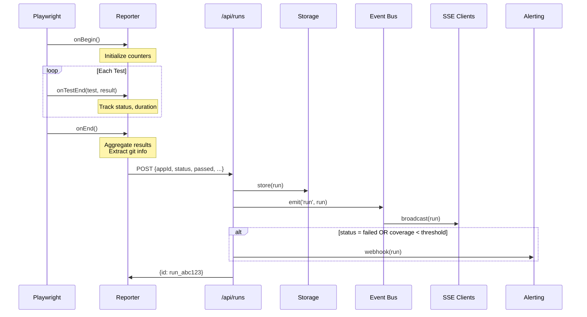
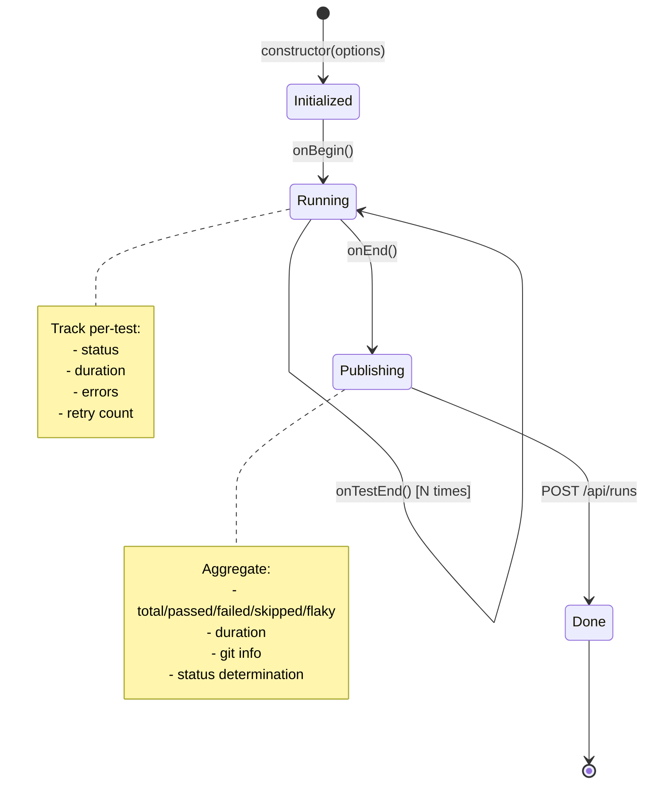

# UX.QA Architecture

## TLDR

- Three-component ecosystem: Dashboard, Reporter, and Scanner
- Event-driven architecture with SSE for real-time updates
- Reporter implements Playwright's Reporter interface
- Pluggable storage (memory, file) and telemetry (Prometheus, InfluxDB)
- Clean separation between data collection, processing, and visualization

## Table of Contents

1. [Overview](#overview)
2. [Component Architecture](#component-architecture)
3. [Data Flow](#data-flow)
4. [Module Structure](#module-structure)
5. [Core Components](#core-components)
6. [Design Decisions](#design-decisions)

## Overview

UX.QA provides a unified test automation dashboard with three main components:

- **Dashboard** - Next.js web app for visualization and API endpoints
- **@ux.qa/reporter** - Playwright reporter that publishes results
- **@ux.qa/scanner** - CLI for React component analysis

## Component Architecture

```mermaid
graph TB
    subgraph "Data Sources"
        PW1[Playwright Project A]
        PW2[Playwright Project B]
        CURL[Custom Scripts]
    end

    subgraph "@ux.qa/reporter"
        REP[UxQaReporter]
    end

    subgraph "Dashboard API"
        API[/api/runs]
        SSE[/api/events]
        PROM[/api/metrics/prometheus]
    end

    subgraph "Data Layer"
        STORE[Storage Driver]
        BUS[Event Bus]
        TELEM[Telemetry]
    end

    subgraph "Storage Options"
        MEM[Memory]
        FILE[File]
    end

    subgraph "Telemetry Options"
        PROM_EXP[Prometheus]
        INFLUX[InfluxDB]
        DD[Datadog]
    end

    subgraph "Frontend"
        UI[React Dashboard]
    end

    PW1 --> REP
    PW2 --> REP
    REP --> API
    CURL --> API

    API --> STORE
    API --> BUS
    API --> TELEM

    STORE --> MEM
    STORE --> FILE

    TELEM --> PROM_EXP
    TELEM --> INFLUX
    TELEM --> DD

    BUS --> SSE
    SSE --> UI
    PROM --> PROM_EXP

    style REP fill:#e1f5ff
    style API fill:#fff4e1
    style STORE fill:#e1ffe1
    style UI fill:#ffe1f5
```

## Data Flow

### Run Submission Flow



### Reporter Lifecycle



## Module Structure

```
ux.qa/
├── app/                          # Next.js App Router
│   ├── page.tsx                  # Main dashboard
│   ├── apps/[appId]/page.tsx     # App detail view
│   └── api/
│       ├── runs/route.ts         # POST/GET runs
│       ├── events/route.ts       # SSE endpoint
│       └── metrics/prometheus/   # Prometheus exporter
│
├── lib/
│   ├── store.ts                  # In-memory data store
│   ├── storage/
│   │   ├── memory.ts             # Memory driver
│   │   └── file.ts               # File persistence
│   └── telemetry/
│       ├── prometheus.ts         # Prometheus metrics
│       └── influx.ts             # InfluxDB client
│
└── packages/
    ├── reporter/                 # @ux.qa/reporter
    │   ├── src/
    │   │   ├── reporter.ts       # UxQaReporter class
    │   │   ├── types.ts          # TypeScript interfaces
    │   │   └── index.ts          # Exports
    │   └── tests/
    │
    └── scanner/                  # @ux.qa/scanner
        ├── src/
        │   ├── cli.ts            # CLI entry point
        │   ├── scanner.ts        # Directory scanner
        │   ├── parser.ts         # Babel AST parser
        │   └── formatter.ts      # Output formatters
        └── tests/
```

## Core Components

### 1. UxQaReporter

Implements Playwright's `Reporter` interface:

```typescript
class UxQaReporter implements Reporter {
    private options: UxQaReporterOptions;
    private startTime: number;
    private testResults: TestResultInfo[];
    private passed, failed, skipped, flaky: number;

    constructor(options: UxQaReporterOptions);
    onBegin(config: FullConfig, suite: Suite): void;
    onTestEnd(test: TestCase, result: TestResult): void;
    async onEnd(result: FullResult): Promise<void>;
}
```

**Responsibilities:**
- Track test results during execution
- Auto-detect CI environment (GitHub, GitLab, Jenkins, CircleCI)
- Extract git info (commit, branch)
- Determine overall run status
- Publish results to dashboard API

### 2. Storage Interface

Pluggable storage with consistent interface:

```typescript
interface StorageDriver {
    save(run: Run): Promise<void>;
    getAll(): Promise<Run[]>;
    getByApp(appId: string): Promise<Run[]>;
    clear(): Promise<void>;
}
```

**Implementations:**
- `MemoryDriver` - Fast, lost on restart
- `FileDriver` - JSON persistence

### 3. Event Bus

SSE-based real-time updates:

```typescript
interface EventBus {
    subscribe(callback: (event: RunEvent) => void): () => void;
    emit(event: RunEvent): void;
    getHistory(): Run[];
}
```

**Events:**
- `bootstrap` - Full history on connect
- `run` - New run created

### 4. Telemetry Exporters

Pluggable metrics export:

```typescript
interface TelemetryExporter {
    record(run: Run): void;
    getMetrics(): string;  // Prometheus format
}
```

## Design Decisions

### 1. Why Playwright Reporter Interface?

**Decision:** Implement Playwright's official Reporter interface

**Rationale:**
- Zero-config integration with `playwright.config.ts`
- Access to full test lifecycle hooks
- Retry and flaky test detection built-in
- Works alongside other reporters (html, junit)

### 2. Why Server-Sent Events over WebSockets?

**Decision:** Use SSE for real-time updates

**Rationale:**
- Simpler protocol for server-to-client only
- HTTP/2 multiplexing support
- Auto-reconnection built into EventSource
- Lower overhead than WebSocket for this use case

### 3. Why Pluggable Storage?

**Decision:** Abstract storage behind interface

**Rationale:**
- Memory for fast local development
- File for simple persistence
- Future: Redis, PostgreSQL without API changes
- Easy testing with mock storage

### 4. Why Separate Packages?

**Decision:** Reporter and Scanner as separate npm packages

**Rationale:**
- Reporter has Playwright peer dependency
- Scanner has Babel dependencies
- Independent versioning
- Users install only what they need

### 5. Why Auto-Detect CI Environment?

**Decision:** Automatically detect CI from environment variables

**Rationale:**
- Zero-config for common CI systems
- Environment variable is reliable signal
- Can still override with explicit option
- Reduces user configuration burden

### 6. Why Status Determination Logic?

**Decision:** Status = failed > flaky > skipped > passed

**Rationale:**
- Failed takes precedence (something is broken)
- Flaky indicates instability (passed after retry)
- Skipped only if nothing else ran
- Passed is default happy path

### 7. Why Prometheus + InfluxDB Support?

**Decision:** Support both Prometheus pull and InfluxDB push

**Rationale:**
- Prometheus: Industry standard for Kubernetes
- InfluxDB: Better for time-series visualization
- Different teams have different stacks
- `UXQA_TELEMETRY` env var to configure

### 8. Why API Key Optional?

**Decision:** API key authentication is opt-in

**Rationale:**
- Simplify local development
- Production can enable via `UXQA_API_KEY`
- Header-based (`x-uxqa-key`) is simple
- No complex OAuth for internal tooling

### 9. Why JSON File Storage?

**Decision:** Simple JSON file for persistence option

**Rationale:**
- No database dependency
- Easy backup/restore
- Human-readable for debugging
- Sufficient for small-medium deployments

### 10. Why Babel for Scanner?

**Decision:** Use @babel/parser for component analysis

**Rationale:**
- Industry standard JSX/TSX parsing
- Full AST access for accurate detection
- Handles TypeScript without compilation
- Mature ecosystem and documentation
