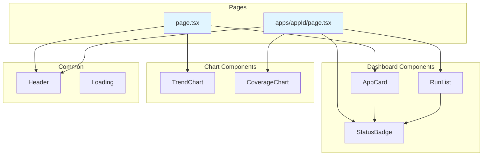
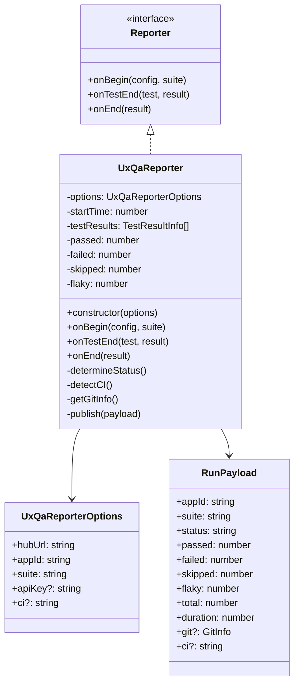
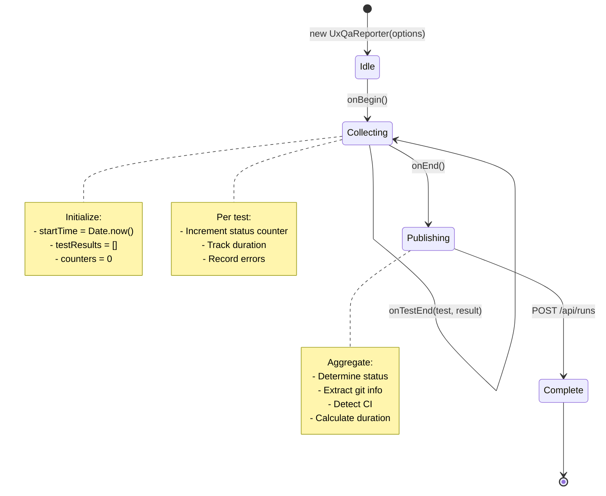
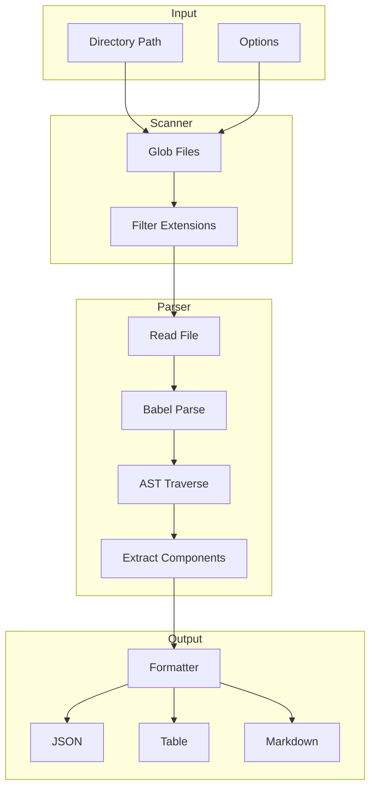
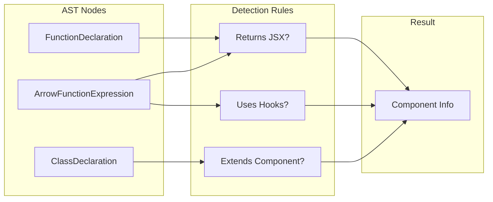
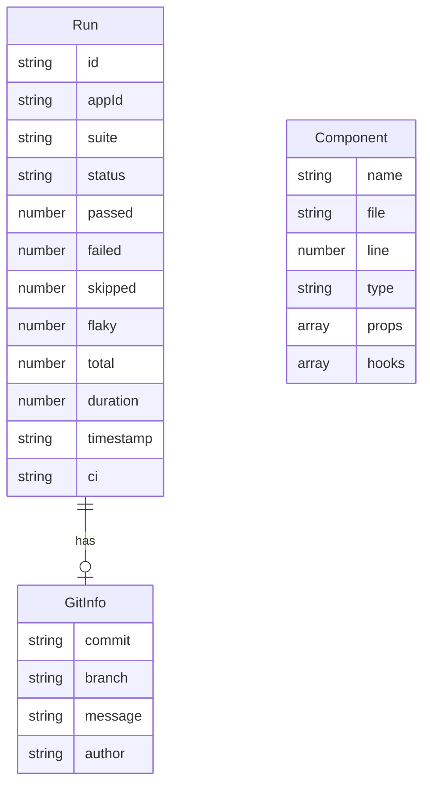

# Component Architecture

## TLDR

- Dashboard: Next.js App Router with React Server Components
- Reporter: Playwright Reporter interface implementation
- Scanner: CLI with Babel AST parsing for React components
- Shared TypeScript types across packages

## Table of Contents

1. [Dashboard Components](#dashboard-components)
2. [Reporter Package](#reporter-package)
3. [Scanner Package](#scanner-package)
4. [Shared Types](#shared-types)
5. [Package Dependencies](#package-dependencies)

## Dashboard Components

### Directory Structure

```
app/
├── page.tsx                    # Main dashboard
├── apps/
│   └── [appId]/
│       └── page.tsx            # App detail view
├── api/
│   ├── runs/
│   │   └── route.ts            # POST/GET test runs
│   ├── events/
│   │   └── route.ts            # SSE endpoint
│   └── metrics/
│       └── prometheus/
│           └── route.ts        # Prometheus metrics
├── layout.tsx                  # Root layout
└── globals.css                 # Global styles

components/
├── dashboard/
│   ├── AppCard.tsx             # Application card
│   ├── RunList.tsx             # Recent runs list
│   └── StatusBadge.tsx         # Pass/fail indicator
├── charts/
│   ├── TrendChart.tsx          # Test trend over time
│   └── CoverageChart.tsx       # Coverage visualization
└── common/
    ├── Header.tsx              # Navigation header
    └── Loading.tsx             # Loading states

lib/
├── store.ts                    # In-memory data store
├── bus.ts                      # Event bus for SSE
├── storage/
│   ├── index.ts                # Storage interface
│   ├── memory.ts               # Memory driver
│   └── file.ts                 # File persistence
└── telemetry/
    ├── index.ts                # Telemetry interface
    ├── prometheus.ts           # Prometheus exporter
    └── influx.ts               # InfluxDB client
```

### Component Hierarchy



### Data Flow

```mermaid
flowchart LR
    subgraph "Client"
        UI[React Components]
        ES[EventSource]
    end

    subgraph "API Routes"
        RUNS[/api/runs]
        EVENTS[/api/events]
    end

    subgraph "Data Layer"
        STORE[Storage]
        BUS[Event Bus]
    end

    UI -->|fetch| RUNS
    RUNS --> STORE

    UI -->|connect| EVENTS
    EVENTS --> BUS
    BUS -->|SSE| ES
    ES -->|update| UI
```

## Reporter Package

### Module Structure

```
packages/reporter/
├── package.json
├── tsconfig.json
├── src/
│   ├── index.ts                # Package exports
│   ├── reporter.ts             # UxQaReporter class
│   └── types.ts                # TypeScript interfaces
└── tests/
    └── reporter.test.ts        # Unit tests
```

### Class Diagram



### Reporter State Machine



## Scanner Package

### Module Structure

```
packages/scanner/
├── package.json
├── tsconfig.json
├── src/
│   ├── index.ts                # Package exports
│   ├── cli.ts                  # CLI entry point
│   ├── scanner.ts              # Directory scanner
│   ├── parser.ts               # Babel AST parser
│   └── formatter.ts            # Output formatters
└── tests/
    ├── scanner.test.ts         # Scanner tests
    ├── parser.test.ts          # Parser tests
    └── fixtures/               # Test fixtures
```

### Processing Pipeline



### Component Detection



## Shared Types

### Core Types

```typescript
// Run - Test execution result
interface Run {
    id: string;
    appId: string;
    suite: string;
    status: 'passed' | 'failed' | 'flaky' | 'skipped';
    passed: number;
    failed: number;
    skipped: number;
    flaky: number;
    total: number;
    duration: number;
    timestamp: string;
    git?: GitInfo;
    ci?: string;
}

// GitInfo - Repository context
interface GitInfo {
    commit: string;
    branch: string;
    message?: string;
    author?: string;
}

// Component - Scanner result
interface Component {
    name: string;
    file: string;
    line: number;
    type: 'function' | 'arrow' | 'class';
    props: string[];
    hooks: string[];
}
```

### Type Relationships



## Package Dependencies

### Dependency Graph

```mermaid
graph TB
    subgraph "Dashboard"
        NEXT[Next.js 14]
        REACT[React 18]
        CHART[Recharts]
    end

    subgraph "@ux.qa/reporter"
        PW[@playwright/test]
    end

    subgraph "@ux.qa/scanner"
        BABEL[@babel/parser]
        TRAV[@babel/traverse]
        GLOB[fast-glob]
        CHALK[chalk]
    end

    subgraph "Shared"
        TS[TypeScript]
    end

    NEXT --> REACT
    NEXT --> TS

    PW -.->|peer| TS

    BABEL --> TS
    TRAV --> BABEL
    GLOB --> TS
    CHALK --> TS
```

### Version Matrix

| Package | Dashboard | Reporter | Scanner |
|---------|-----------|----------|---------|
| TypeScript | 5.3+ | 5.3+ | 5.3+ |
| Node.js | 18+ | 18+ | 18+ |
| React | 18.2+ | - | - |
| Next.js | 14+ | - | - |
| Playwright | - | 1.40+ (peer) | - |
| Babel | - | - | 7.23+ |
